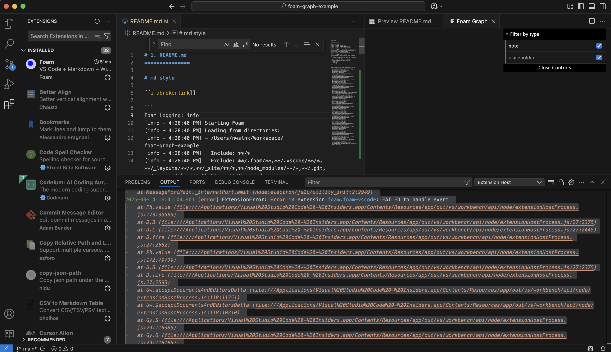
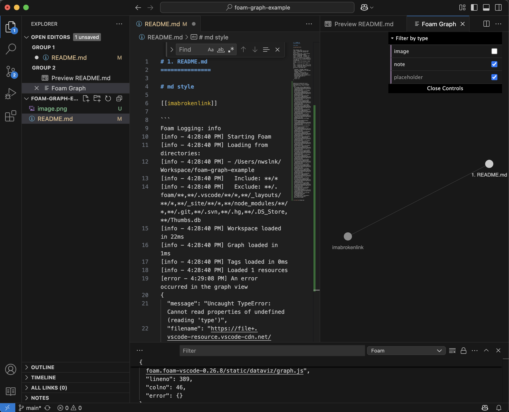

# 1. README.md
===============

# md style

[[imabrokenlink]]

```
Foam Logging: info
[info - 4:28:40 PM] Starting Foam
[info - 4:28:40 PM] Loading from directories:
[info - 4:28:40 PM] - /Users/nwslnk/Workspace/foam-graph-example
[info - 4:28:40 PM]   Include: **/*
[info - 4:28:40 PM]   Exclude: **/.foam/**,**/.vscode/**/*,**/_layouts/**/*,**/_site/**/*,**/node_modules/**/*,**/.git,**/.svn,**/.hg,**/.DS_Store,**/Thumbs.db
[info - 4:28:40 PM] Workspace loaded in 22ms
[info - 4:28:40 PM] Graph loaded in 1ms
[info - 4:28:40 PM] Tags loaded in 0ms
[info - 4:28:40 PM] Loaded 1 resources
[error - 4:29:08 PM] An error occurred in the graph view
{
  "message": "Uncaught TypeError: Cannot read properties of undefined (reading 'type')",
  "filename": "https://file+.vscode-resource.vscode-cdn.net/Users/nwslnk/.vscode-insiders/extensions/foam.foam-vscode-0.26.8/static/dataviz/graph.js",
  "lineno": 389,
  "colno": 46,
  "error": {}
}
```

```
2025-03-14 16:40:04.629 [error] ExtensionError: Error in extension foam.foam-vscode: FAILED to handle event
	at Ph.value (file:///Applications/Visual%20Studio%20Code%20-%20Insiders.app/Contents/Resources/app/out/vs/workbench/api/node/extensionHostProcess.js:173:35569)
	at D.B (file:///Applications/Visual%20Studio%20Code%20-%20Insiders.app/Contents/Resources/app/out/vs/workbench/api/node/extensionHostProcess.js:27:2375)
	at D.C (file:///Applications/Visual%20Studio%20Code%20-%20Insiders.app/Contents/Resources/app/out/vs/workbench/api/node/extensionHostProcess.js:27:2445)
	at D.fire (file:///Applications/Visual%20Studio%20Code%20-%20Insiders.app/Contents/Resources/app/out/vs/workbench/api/node/extensionHostProcess.js:27:2662)
	at Ph.value (file:///Applications/Visual%20Studio%20Code%20-%20Insiders.app/Contents/Resources/app/out/vs/workbench/api/node/extensionHostProcess.js:172:70790)
	at D.B (file:///Applications/Visual%20Studio%20Code%20-%20Insiders.app/Contents/Resources/app/out/vs/workbench/api/node/extensionHostProcess.js:27:2375)
	at D.fire (file:///Applications/Visual%20Studio%20Code%20-%20Insiders.app/Contents/Resources/app/out/vs/workbench/api/node/extensionHostProcess.js:27:2593)
	at Uw.acceptDocumentsAndEditorsDelta (file:///Applications/Visual%20Studio%20Code%20-%20Insiders.app/Contents/Resources/app/out/vs/workbench/api/node/extensionHostProcess.js:118:11751)
	at Uw.$acceptDocumentsAndEditorsDelta (file:///Applications/Visual%20Studio%20Code%20-%20Insiders.app/Contents/Resources/app/out/vs/workbench/api/node/extensionHostProcess.js:118:10210)
	at Gy.S (file:///Applications/Visual%20Studio%20Code%20-%20Insiders.app/Contents/Resources/app/out/vs/workbench/api/node/extensionHostProcess.js:29:116385)
	at Gy.Q (file:///Applications/Visual%20Studio%20Code%20-%20Insiders.app/Contents/Resources/app/out/vs/workbench/api/node/extensionHostProcess.js:29:116165)
	at Gy.M (file:///Applications/Visual%20Studio%20Code%20-%20Insiders.app/Contents/Resources/app/out/vs/workbench/api/node/extensionHostProcess.js:29:115254)
	at Gy.L (file:///Applications/Visual%20Studio%20Code%20-%20Insiders.app/Contents/Resources/app/out/vs/workbench/api/node/extensionHostProcess.js:29:114359)
	at Ph.value (file:///Applications/Visual%20Studio%20Code%20-%20Insiders.app/Contents/Resources/app/out/vs/workbench/api/node/extensionHostProcess.js:29:113156)
	at D.B (file:///Applications/Visual%20Studio%20Code%20-%20Insiders.app/Contents/Resources/app/out/vs/workbench/api/node/extensionHostProcess.js:27:2375)
	at D.fire (file:///Applications/Visual%20Studio%20Code%20-%20Insiders.app/Contents/Resources/app/out/vs/workbench/api/node/extensionHostProcess.js:27:2593)
	at Yn.fire (file:///Applications/Visual%20Studio%20Code%20-%20Insiders.app/Contents/Resources/app/out/vs/workbench/api/node/extensionHostProcess.js:29:9459)
	at Ph.value (file:///Applications/Visual%20Studio%20Code%20-%20Insiders.app/Contents/Resources/app/out/vs/workbench/api/node/extensionHostProcess.js:194:3504)
	at D.B (file:///Applications/Visual%20Studio%20Code%20-%20Insiders.app/Contents/Resources/app/out/vs/workbench/api/node/extensionHostProcess.js:27:2375)
	at D.fire (file:///Applications/Visual%20Studio%20Code%20-%20Insiders.app/Contents/Resources/app/out/vs/workbench/api/node/extensionHostProcess.js:27:2593)
	at Yn.fire (file:///Applications/Visual%20Studio%20Code%20-%20Insiders.app/Contents/Resources/app/out/vs/workbench/api/node/extensionHostProcess.js:29:9459)
	at MessagePortMain.<anonymous> (file:///Applications/Visual%20Studio%20Code%20-%20Insiders.app/Contents/Resources/app/out/vs/workbench/api/node/extensionHostProcess.js:194:1796)
	at MessagePortMain.emit (node:events:518:28)
	at MessagePortMain._internalPort.emit (node:electron/js2c/utility_init:2:2949)
```



